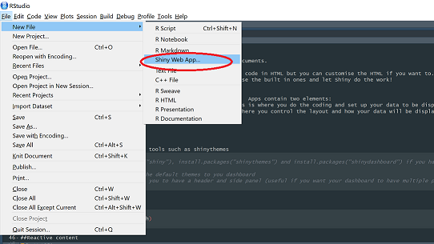
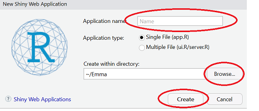
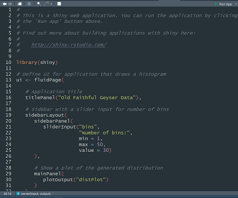

```{r setup, include=FALSE}
knitr::opts_chunk$set(echo = FALSE)

```
###Introduction to Shiny package in R


\


#### What is Shiny?

Shiny is a package in R used for making dashboards and interactive documents.

The front-end  uses HTML and CSS for the layout, so you don't have to code in HTML but you can customise the HTML if you want to.  You can also add your own CSS to personalise the colour scheme and fonts, or you can just use the built in ones and let Shiny do the work!


Apps can be hosted on the free Shiny server or hosted on your own server.  Apps comprise two main features:  

* Server: Back-end control of the content within your app.  This is where you do the coding and set up your data to be displayed.  

* User interface (UI): Front-end control of the app.  This is where you control the layout and how your data will be displayed.

In this document, I have embedded Shiny apps as examples to demonstrate the various components of a Shiny app.  I have also included the script used to generate the app.  The purpose of this document is to introduce you to the different features of a Shiny app. This is not an exhaustive list, but merely the basic elements that comprise an app. See (https://shiny.rstudio.com/) for full documentation and guides on more complex examples. 

### Making a Shiny app

\


####Step 1: Install Shiny 

\

You may also need to install additional tools such as shinythemes

\


```{r, include=T, echo=T,eval=F}
#you will need to install these packages if you haven't already done so:
install.packages("shiny") 
install.packages("shinythemes")
install.packages("shinydashboard")
library(shiny) # Main shiny features
library(shinythemes) # For applying the default themes to you dashboard 
library(shinydashboard) # This allows you to have a header and side panel (useful if you want your dashboard to have multiple pages)
```


\


Click on File > New File > Shiny Web App  

\




\

You can either choose one or two file Shiny - there is no difference between them.  Older versions had the server.R and ui.R separate, newer versions combine them into one file and define which is the server and which is the UI.  The choice makes no difference to how the app works.   
  

\




\


This will then open up a new document where you can being to edit your server and ui: 
  
\

  



\


###Step 2: Loading and displaying data in the server and UI scripts

\

There are two main components involved in Shiny apps in terms of the data: outputs and inputs. Outputs are used to call variables to be displayed, e.g. a graph, and inputs enable documents to be interactive, e.g. using a slider bar or date selector.  Both inputs and outputs need to be set up in the server.R script and also in the UI.R script.  

####Outputs

Each element (e.g. graph or table) you want to visualise in the app needs to be rendered as an output.  These elements first need to be set up as output variables, rendered in the server.R script and then called in the UI, to control where these outputs will be laid out on the app page.

To begin your writing your server code, you need to start with:

\
```{r, eval=F, echo=T}
function(input, output){
#assign variables and write code here
}
```
Inside the curly braces, you set up your code like a regular R script - e.g. import data, define variables etc.  Each element that you want to be displayed in the app (such as a graph or table) is prefixed with the expression *output$ * e.g. output$plot  - this ensures that when you call this element in the UI script, this element will be displayed in the UI.

Outputs are usually things like graphs, images, tables and datatables. There are two ways of setting up an element to be displayed:  

1. Write the code like you normally would in an R script (import data, define variables), then call variables into your output.  Note - here you still need to write the plotting code inside the output function because this function renders the plot here and expects a plotting code here.  
       
```{r, echo=T, eval=T}

library(shiny)
# Define server logic required to draw a histogram
server <- function(input, output) {
    x    <- faithful[, 2] #defining variable x
     bins <- seq(min(x), max(x)) #defining variable bins
     
     output$distPlot <- renderPlot({
 hist(x, breaks = bins, col = 'darkgray', border = 'white')
     
   })
}
# Define UI for application that draws a histogram
ui <- fluidPage(
   
   # Application title
   titlePanel(""),
      mainPanel(
         plotOutput("distPlot")
      )
   )

# Run the application 
shinyApp(ui = ui, server = server)
```


2. Write the code for the variables within the output function  
```{r, echo=T, eval=T}

library(shiny)
# Define server logic required to draw a histogram
server <- function(input, output) {
   
   output$distPlot <- renderPlot({
      # generate bins based on input$bins from ui.R
     x    <- faithful[, 2] 
     bins <- seq(min(x), max(x))
      
      # draw the histogram with the specified number of bins
      hist(x, breaks = bins, col = 'darkgray', border = 'white')
   })
}
# Define UI for application that draws a histogram
ui <- fluidPage(
   
   # Application title
   titlePanel(""),
      mainPanel(
         plotOutput("distPlot")
      )
   )

# Run the application 
shinyApp(ui = ui, server = server)

```

\


####Inputs

\

Inputs are used with outputs to make your documents interactive (e.g. a slider tool).  Some inputs include:  

* Buttons

* Checkboxes

* Sliders

* Radio buttons

Input values change according to user input - including interactive inputs such as a slider means that the code takes in the input value from the slider and updates the output (e.g. a graph) based on the value selected by the user.

\


####Slider example

\
```{r, echo = T}

x    <- faithful[, 2] 
bins <- seq(min(x), max(x))
sliderInput("bins", "Number of bins:", min = 1, max = 50, value = 30) #these values come from your data


```
\


####Radio buttons example

\

```{r, echo=T}


listA<-c("Blue", "Yellow", "White")
radioButtons("listA", ("Choose a colour"),choices=list("Blue" = 1,
                          "Yellow" = 2,
                          "White" =3),
             selected=1)


```

\
Inputs are linked with outputs: for example, when a user selects blue from the radio button list above.  The input value in the server script will update to reflect this change and display the data associated with blue.  This updating of outputs based on inputs by the user is known as reactivity.

###Reactive content

Reactive content relies on assigning a reactive function to one or a number of inputs.  The values of these inputs change as the user changes the slider or buttons in the UI.  In the example below, try changing the distribution type and the number of observations and note how the graph updates with these changes.

\
```{r, echo = T, eval=T}

library(shiny)
# Define server logic required to draw a histogram
server <- function(input, output) {
  # Reactive expression to generate the requested distribution ----
  # This is called whenever the inputs change. The output functions
  # defined below then use the value computed from this expression
  d <- reactive({
    dist <- switch(input$dist,
                   norm = rnorm,
                   unif = runif,
                   lnorm = rlnorm,
                   exp = rexp,
                   rnorm)

    dist(input$n)
  })

  # Generate a plot of the data ----
  # Also uses the inputs to build the plot label. Note that the
  # dependencies on the inputs and the data reactive expression are
  # both tracked, and all expressions are called in the sequence
  # implied by the dependency graph.
  output$plot <- renderPlot({
    dist <- input$dist
    n <- input$n

    hist(d(),
         main = paste("r", dist, "(", n, ")", sep = ""),
         col = "#75AADB", border = "white")
  })


}
# Define UI for application that draws a histogram
ui <- fluidPage(
  titlePanel(""),

  # Sidebar layout with input and output definitions ----
  sidebarLayout(

    # Sidebar panel for inputs ----
    sidebarPanel(

      # Input: Select the random distribution type ----
      radioButtons("dist", "Distribution type:",
                   c("Normal" = "norm",
                     "Uniform" = "unif",
                     "Log-normal" = "lnorm",
                     "Exponential" = "exp")),

      # br() element to introduce extra vertical spacing ----
      br(),

      # Input: Slider for the number of observations to generate ----
      sliderInput("n",
                  "Number of observations:",
                  value = 500,
                  min = 1,
                  max = 1000)
    ),
      
      mainPanel(
         plotOutput("plot")
      

    )
  )
)

# Run the application 
shinyApp(ui = ui, server = server)

```

The main thing to remember when including reactive elements is that reactivity relies on inputs.  These inputs change the display of the outputs immediately by reacting to the user changing the input value. 


There are various inputs and widgets available depending on what you want to include: see (http://shiny.rstudio.com/articles/layout-guide.html) for detailed examples.  

###Step 3: Layout of the app

The layout of the app is controlled in the UI script.  This part of the script deals with how the content is physically laid out on the page.  The default layout includes a sidebar panel, which can be used for including items such as a slider, radio buttons or links to other pages.

The layout relies on the Bootstrap2 grid system (https://getbootstrap.com/docs/3.3/css/) and so most apps start the UI with UI(fluidPage()) as this ensures that the page will adapt to the size of screen you are using.  When you add elements you can specify where on the page you want these elements to be placed by using the grid system.  Using fluidRow(column (4,"plot")) for example will place the plot with a width of 4. The order if the elements in the script determines the order they appear on the page.    

Shiny has a number of themes within the Shinythemes package.  You can apply these themes to your page (see http://rstudio.github.io/shinythemes/ for a list of themes).  In the example below, I have used the theme "darkly" to change the default theme to the "darkly" theme.


```{r, echo = T, eval=T}

library(shiny)
library(shinythemes)
# Define server logic required to draw a histogram
server <- function(input, output) {
  # Reactive expression to generate the requested distribution ----
  # This is called whenever the inputs change. The output functions
  # defined below then use the value computed from this expression
  d <- reactive({
    dist <- switch(input$dist,
                   norm = rnorm,
                   unif = runif,
                   lnorm = rlnorm,
                   exp = rexp,
                   rnorm)

    dist(input$n)
  })

  # Generate a plot of the data ----
  # Also uses the inputs to build the plot label. Note that the
  # dependencies on the inputs and the data reactive expression are
  # both tracked, and all expressions are called in the sequence
  # implied by the dependency graph.
  output$plot <- renderPlot({
    dist <- input$dist
    n <- input$n

    hist(d(),
         main = paste("r", dist, "(", n, ")", sep = ""),
         col = "#75AADB", border = "white")
  })


}
# Define UI for application that draws a histogram
ui <- fluidPage(
   theme = shinythemes::shinytheme("darkly"),
  titlePanel("Example with theme"),

  # Sidebar layout with input and output definitions ----
  sidebarLayout(

    # Sidebar panel for inputs ----
    sidebarPanel(

      # Input: Select the random distribution type ----
      radioButtons("dist", "Distribution type:",
                   c("Normal" = "norm",
                     "Uniform" = "unif",
                     "Log-normal" = "lnorm",
                     "Exponential" = "exp")),

      # br() element to introduce extra vertical spacing ----
      br(),

      # Input: Slider for the number of observations to generate ----
      sliderInput("n",
                  "Number of observations:",
                  value = 500,
                  min = 1,
                  max = 1000)
    ),
      
      mainPanel(
         plotOutput("plot")
      

    )
  )
)

# Run the application 
shinyApp(ui = ui, server = server)

```

\

If you do not want to use the in-built themes, you can create your own using CSS and instead of calling one of the shiny themes, call your own:

```{r, echo=T, eval=F}
fluidPage(
  theme = "mytheme.css",
  ...
)
```

\

If you want to use your own CSS files, you need to place these inside the www/ folder in the ShinyServer (this folder is create automatically when you deploy your app).

###Step 4: Deploying the app on a server

Once you have built your shiny app, it needs to be deployed to a server so users can access it.  There are a number of options available such as:

* Deploy to the cloud using Shinyapps.io -free and paid options are available here, but free access means users can only access it for 25 hours a month.  The advantage of using Shinyapp.io means you don't have to set up the Shiny server on your own machine.  

* Deploy to the open source Shiny Server - means you can have unlimited access to the server, but you are vulnerable to attack.

* Deploy to the commerical Shiny Server Pro - this is a service that comes with a fee, but has extra secruity features and support for enterprise needs.


###Final remarks

You should now be able to build a basic Shiny app and customise it using this introduction and the resources available on the Shiny website (https://shiny.rstudio.com/tutorial/)
